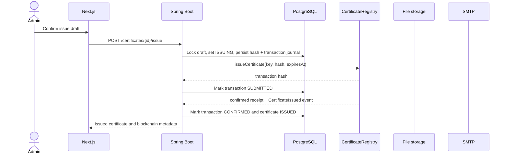
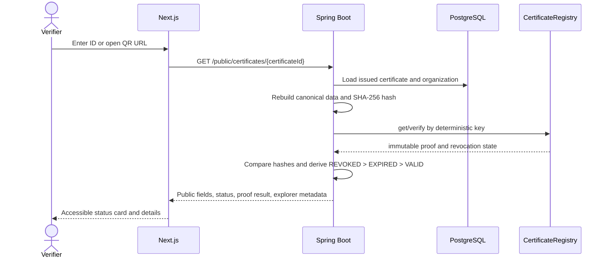
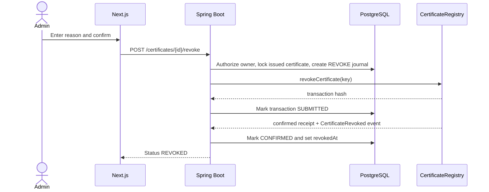

# Certificate Workflows

## Issuance

Failure behavior:

- Validation or authorization failure stops before any chain call.
- A reverted or failed receipt sets the transaction to `FAILED` and certificate to `ISSUE_FAILED`; it is not public.
- A timeout remains `SUBMITTED`/`ISSUING` until reconciliation determines the receipt outcome.
- An RPC submission error with no returned hash remains `CREATED`/`ISSUING`: the transaction may have reached the chain. Reconciliation searches by deterministic key and event before any new submission is considered.
- PDF and email delivery are later phases; their failures must never undo immutable issuance.

## Public verification

The QR contains only `https://<frontend>/verify/<certificateId>`. An unavailable RPC produces a clear verification-unavailable state, not a false valid result.

## Revocation

The reason is private and persisted before submission. The on-chain call carries only the certificate key. A missing receipt leaves the journal pending; a validated revert records failure without `revokedAt`. After a crash, reconciliation searches the known hash or indexed revocation event. Public verification derives `REVOKED > EXPIRED > VALID` on each read and never exposes the reason.

