**CertChain - Assignment Report (evidence draft)**
Prepared 29 September 2026. This is a draft because a public deployment, Sepolia transaction, complete UI screenshot set, and public demo video are not yet available. Local screenshots use synthetic data and a Hardhat chain. No production deployment is claimed.

## 1. System Overview

CertChain lets an educational organization create and manage digital certificates while a public visitor checks whether an issued certificate has a matching blockchain proof. An organization administrator signs in, creates a draft, confirms issuance, downloads the generated PDF, and can later revoke the certificate with a private reason. A recipient or verifier opens the QR link or enters `CERT-YYYY-NNNNNN` on the public page.

The design separates three kinds of information. PostgreSQL is the operational database for organizations, users, certificate details, recipient email, transaction and delivery journals, and private revocation reasons. Private file or object storage holds generated PDFs. Ethereum stores only a deterministic certificate key, a `bytes32` SHA-256 proof, issue and optional expiry timestamps, issuer address, and a one-way revocation flag. The chain does not contain names, emails, PDF bytes, or the revocation reason.

The implemented system runs locally with PostgreSQL and Hardhat. The public GitHub repository is available. Sepolia deployment, production hosting, and a public video remain pending; the free-tier deployment plan is in `docs/deployment/free-tier.md`.

## 2. System Architecture

The repository has a Next.js/React frontend, a Java 21 Spring Boot 4.1.1 backend, a PostgreSQL database with Flyway migrations, and a Solidity `CertificateRegistry` contract. The frontend renders the portal and public verification pages. The backend owns authentication, tenant authorization, canonicalization, signing, transaction recovery, PDF generation, and email delivery. It accesses the chain through web3j and a server-side issuer wallet.

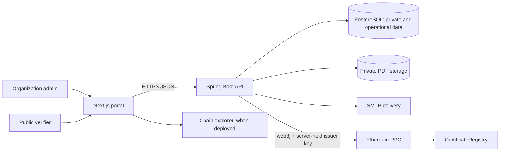

The frontend can suggest valid inputs and guard navigation, but the backend authorizes every protected route using the verified JWT's organization ID. The portal never sends an authoritative hash, status, transaction hash, role, or issuer private key.

## 3. User Flow / System Flow

**Issuance.** An admin creates a tenant-owned draft. The server allocates the public ID with a PostgreSQL global yearly sequence. On confirmation, the backend locks the record, freezes proof-relevant fields, computes the canonical SHA-256 hash, and commits a `CREATED` blockchain journal before sending a transaction. It stores the returned hash as `SUBMITTED`, then marks the certificate `ISSUED` only after validating the receipt, confirmations, expected contract, issuer, event, and on-chain record. A timeout stays pending for reconciliation; a failed receipt cannot become issued. PDF generation and email run afterward and can be retried without another chain issue call.

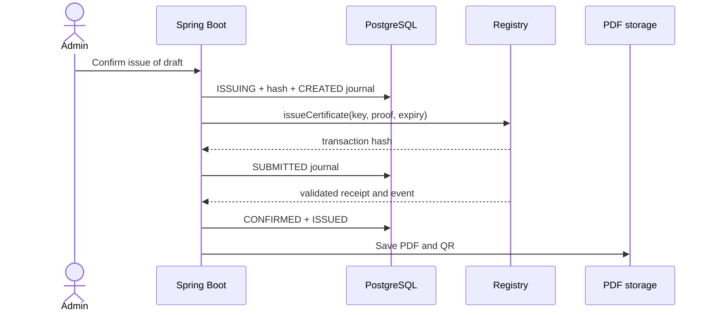

**Verification.** The public route accepts only a strict public ID and exposes issued certificates. The backend rebuilds the canonical string, recomputes SHA-256, compares it with the stored hash and chain proof, checks the expected network/contract and revocation consistency, then derives status. Unknown, malformed, and draft IDs share a not-found response. An RPC outage or proof mismatch does not produce a false verified or valid result.

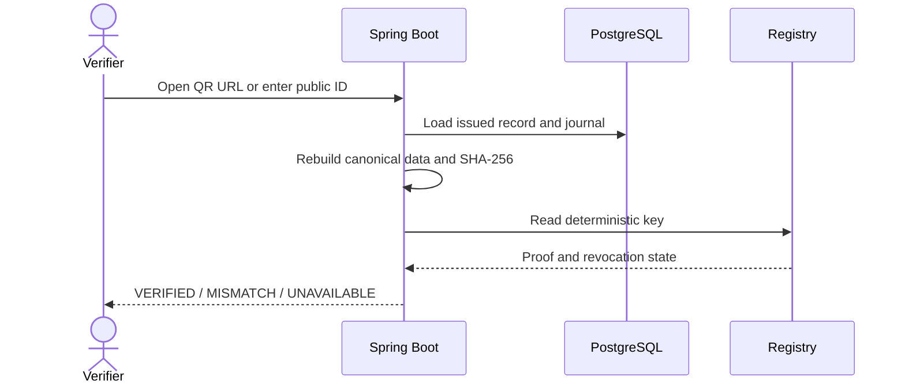

**Revocation.** The admin enters a private reason and explicitly confirms. The backend journals `CREATED` and `SUBMITTED`, validates a `CertificateRevoked` receipt/event, and only then sets `revokedAt`. A timeout stays pending for recovery, and an uncertain transaction is not blindly resent. Public status gives `REVOKED` priority over `EXPIRED`; expiration is derived at read time after the UTC expiry date.

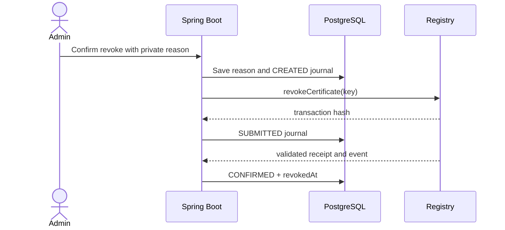

## 4. Database Design / ER Diagram

Flyway migrations create normalized tables for `organization`, `app_user`, `certificate`, `blockchain_transaction`, `email_delivery`, and `certificate_number_sequence`. A certificate belongs to one organization, has zero or more transaction and email journal rows, and retains its own immutable public ID. Transaction hash, chain ID, network, contract, block, confirmation, and failure details live in `blockchain_transaction`, not duplicated on `certificate`. Public `VALID`/`EXPIRED`/`REVOKED` status is computed, not persisted.

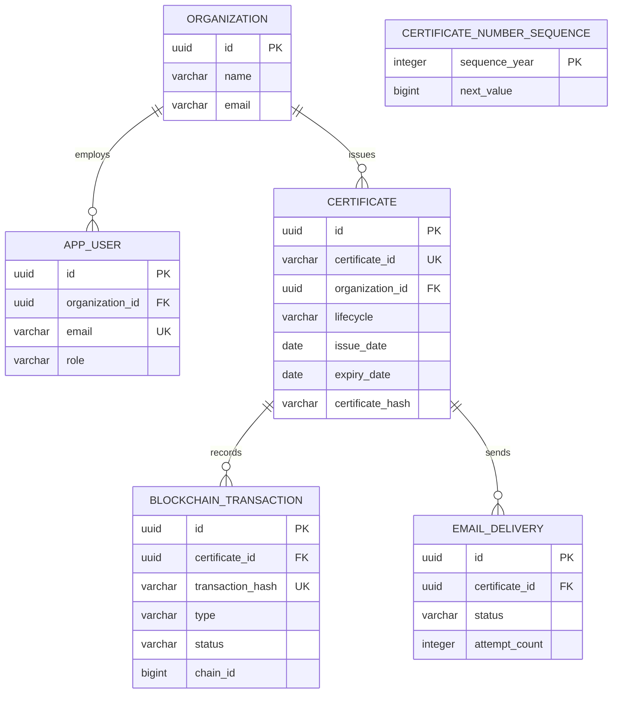

UUIDs are internal keys; `certificate_id` is unique and formatted `CERT-YYYY-NNNNNN`. The global yearly sequence uses one atomic PostgreSQL upsert per allocation, allows gaps after rollback, and rejects exhaustion after `999999`. The database also enforces case-insensitive unique user emails, nonnegative journal values, valid enum strings, transaction-hash uniqueness, and `expiry_date >= issue_date` when expiry exists. Foreign keys restrict deletion of issued history.

## 5. Blockchain Architecture

The backend computes `certificateKey = keccak256(UTF-8(uppercase(trim(public ID))))`; this hides the readable ID from the contract mapping but gives a stable lookup key. The proof is `SHA-256(UTF-8(canonical data))`. Version `v1` fixes the field order: public ID, recipient name, program, organization UUID, issue date, expiry date. Text is Unicode NFC normalized, trimmed, internal whitespace collapsed, and backslash/pipe/equals escaped. The ID is uppercased with `Locale.ROOT`; names and programs keep their case. Dates use ISO format and a missing expiry is empty. This prevents logically equivalent text from producing accidental different proofs.

The backend signs transactions with a server-held issuer key. The user browser never gets this key. A separate admin account controls contract roles. Local Hardhat tests and local-chain integration have been exercised; no Sepolia address or explorer transaction is available yet. Transaction journals preserve `CREATED`, `SUBMITTED`, `CONFIRMED`, and `FAILED` states across process failures. Reconciliation checks a known hash or on-chain event/key before a retry, avoiding duplicate issuance or revocation.

## 6. Smart Contract Design

`CertificateRegistry.sol` uses OpenZeppelin `AccessControlDefaultAdminRules` with an explicit admin, a one-day delayed admin transfer, and `ISSUER_ROLE` for issue and revoke. The constructor rejects zero addresses. Issuance rejects zero key/hash, duplicates, and expiry at or before the block time. Records are never overwritten. Revocation rejects missing or already revoked keys. Indexed `CertificateIssued` and `CertificateRevoked` events support receipt validation and recovery. Public read and verify functions return deterministic results; on-chain expiry is true only after `expiresAt`, and application status prioritizes revocation.

The contract stores only key, proof hash, issue/expiry timestamps, issuer, and revoked flag. Eight contract tests passed locally; the latest recorded coverage reports 100% line and statement coverage for `CertificateRegistry.sol`. Source verification on Sepolia is pending.

## 7. User Interface Design / Screenshots

The portal uses a restrained educational trust style with clear labels, focus states, loading/empty/error states, and text/icon status cues. The login screen and the screenshots below are actual browser or PDF renders from the codebase. The verification screenshots came from a synthetic local PostgreSQL and Hardhat demonstration, not a public deployment.

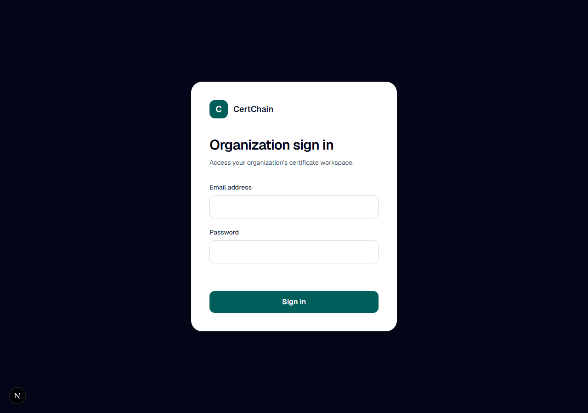
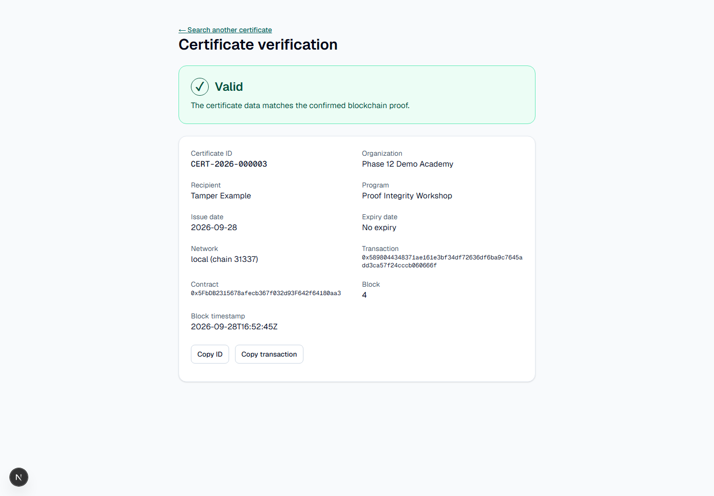
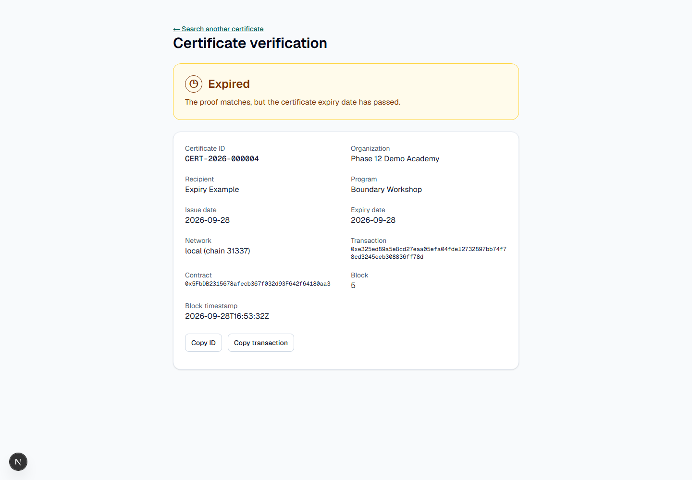
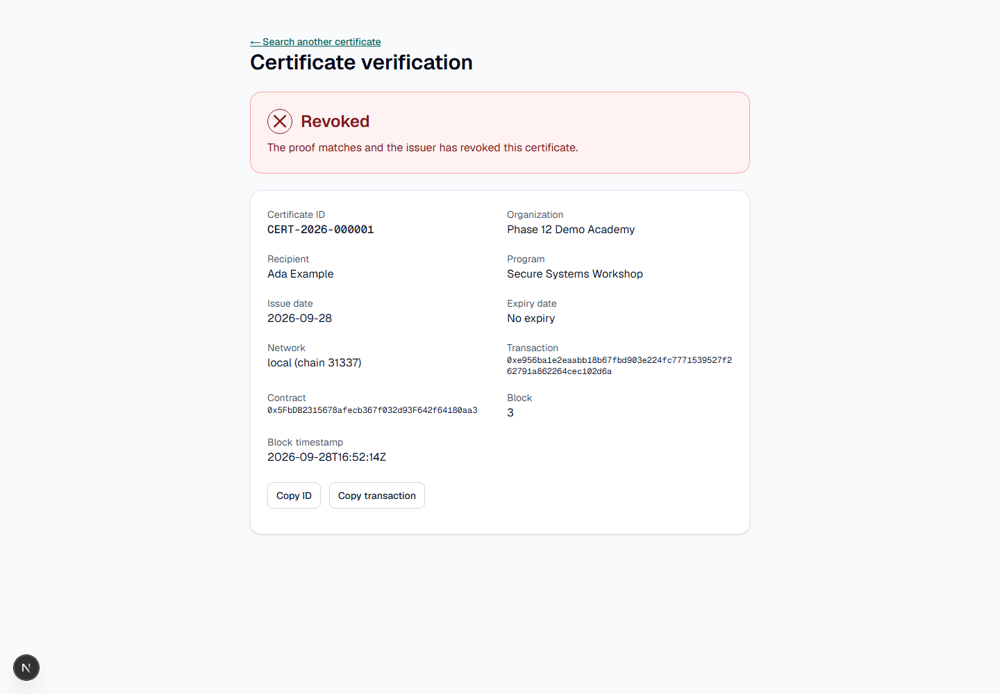
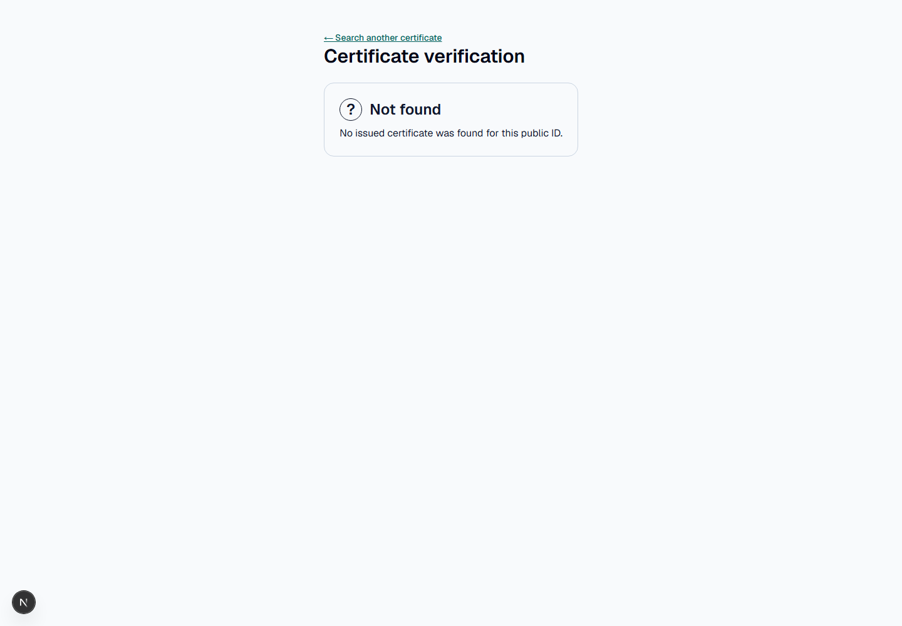
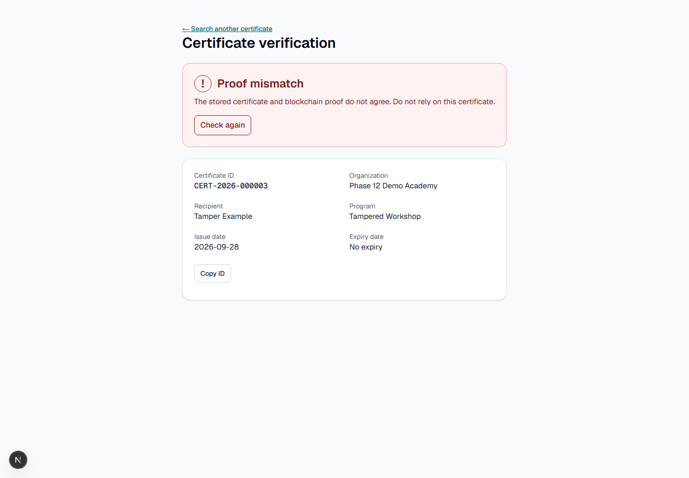

The generated PDF/QR image is a synthetic test fixture whose verification URL is an example domain, not a live site. Real dashboard, create, admin details, issue/revocation transaction, and explorer screenshots are still needed. Do not substitute designs or fabricated transaction images for those captures.

## 8. Implementation Summary

Implemented features include authentication with BCrypt and short-lived JWT cookies, CSRF protection, tenant-safe draft management, deterministic proof hashing, a role-controlled registry, failure-safe issuance/revocation journals, public verification, PDF/QR generation, bounded email delivery, and a tenant dashboard. The backend stores authoritative chain metadata in transaction rows; PDF and email failures do not undo confirmed issuance. A private S3-compatible storage adapter and a free-tier deployment configuration are prepared but not verified against live services.

On 29 September 2026, the backend test command reported 81 tests with zero failures/errors and 38 Testcontainers skips because Docker Desktop was unavailable; 43 tests executed. Earlier isolated external-PostgreSQL runs executed five tests, and external local-chain runs executed three, with no skips or failures, as documented in `docs/screenshots/phase12-local-evidence.md`. Frontend lint, build, and 28 tests passed; eight contract tests and coverage passed. These results do not prove a public Sepolia or production deployment. A full Docker-backed run, production smoke tests, backup/restore check, and live storage/SMTP checks remain open.

## 9. Public GitHub Repository Link

[https://github.com/Thna17/CertChain](https://github.com/Thna17/CertChain) is public and contains the source, migrations, diagrams, tests, and local synthetic evidence. The `main` branch was current at the time this draft was prepared. No public app URL or explorer transaction exists yet.

## 10. Individual Contribution Report

Git history contains exactly two author identities before this report. **Hong Than Brathna** (`hangbrathna10@gmail.com`) authored foundation commit `8b67919` on 22 September 2026. That commit established the repository, Next.js/Spring Boot/Hardhat scaffolds, Maven wrapper, Docker Compose, environment templates, initial interface and security skeleton, and first architecture, API, database, flow, blockchain, and checklist documents.

At the report evidence cutoff, **Seypa47** (`khemrakpasey01@gmail.com`) authored 14 subsequent commits through `80ab457`. Their diffs added the database/domain layer, PostgreSQL tests, authentication, draft management, registry contract, hashing and blockchain workflows, verification, PDF/QR, revocation, email, dashboard, security tests, and deployment preparation. These statements describe Git-authored changes, not a measured percentage of effort. No PR, review, design-session, pair-programming, or separate test-session record was supplied. Commit count alone cannot establish a fair effort split; any uncommitted contribution needs independently verifiable evidence before it is credited.

## 11. Public Demo Video Link

**Pending.** No public demo video URL was supplied as of 29 September 2026. The ordered narration and recording checklist are in `docs/report/demo-recording-script.md`. The report must be finalized only after a real URL is available and checked. The video should distinguish local Hardhat evidence from a future Sepolia deployment.
